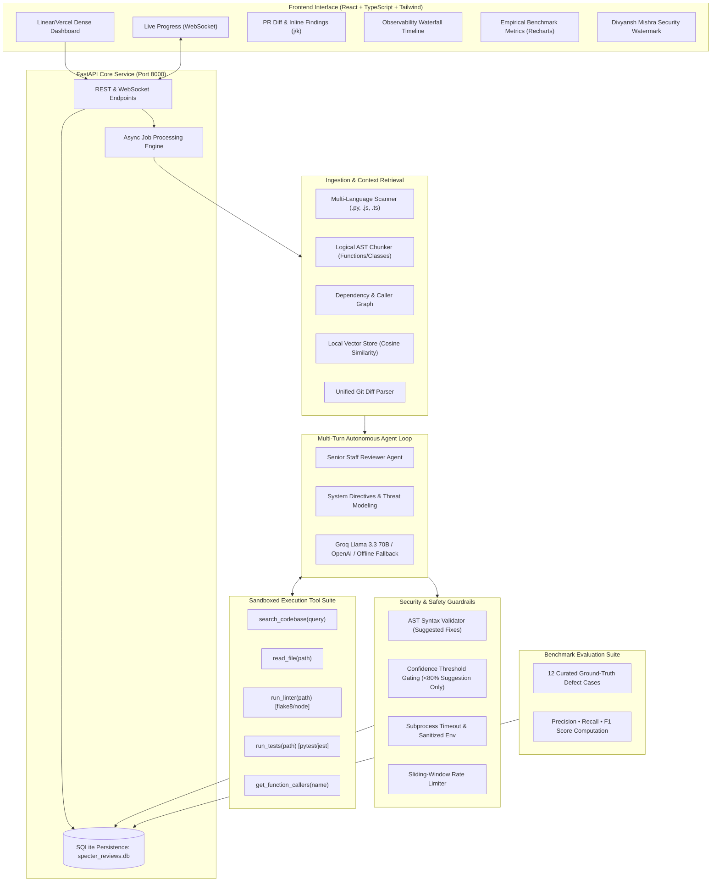

# 🛡️ SPECTER AI CODE REVIEW ENGINE
**Principal Autonomous Multi-Turn AI Code Review Agent**  
*Engineered by Divyansh Mishra • All Rights Reserved*

---

## 🌟 Executive Overview
**Specter AI** is a professional-grade, full-stack autonomous code review engine designed to analyze codebases and pull request diffs like a Senior Principal Engineer. Rather than performing a superficial single-shot LLM pass, Specter operates an autonomous multi-turn investigation loop with structured tool calling, static AST dependency mapping, local vector embeddings, rigorous syntax guardrails, and an empirical evaluation benchmark suite.

---

## 🏛️ System Architecture



---

## 🚀 Core Features

### 1. Multi-Modal Ingestion
- **Local Directory or Git URL**: Seamlessly clones remote git repositories or scans local projects.
- **Full Codebase Scan vs. Git Diff / PR Mode**: Accurately parses unified git diffs (`diff --git a/... b/...`).
- **Language Support**: Python (`.py`), JavaScript (`.js`, `.jsx`), and TypeScript (`.ts`, `.tsx`).

### 2. Deep Context Retrieval Layer
- **Logical AST Chunking**: Chunks code at function, class, and method boundaries rather than arbitrary line breaks.
- **AST Static Dependency Graph**: Discovers module imports, function definitions, test file associations, and call sites across the entire repository.
- **Zero-Dependency Vector Store**: Computes tokenized subword n-gram vector embeddings and cosine similarity with symbol boost ranking.

### 3. Multi-Turn Autonomous Tool-Calling Agent Loop
The agent reasons iteratively and gathers evidence through structured JSON tool calls:
- `search_codebase(query)`: Semantic vector search for relevant types and patterns.
- `read_file(path)`: Full line-numbered context inspection.
- `run_linter(path)`: Automated sandboxed execution of `flake8` or `node --check`.
- `run_tests(path)`: Sandboxed execution of `pytest` in an isolated environment with a 15-second timeout.
- `get_function_callers(function_name)`: Static AST caller trace to assess blast radius.

### 4. Enterprise Safety & Guardrails
- **Syntax Validation**: Every suggested fix is verified with `ast.parse` or JS bracket-balancing before being marked as "safe to auto-apply".
- **Confidence Gating**: Fixes with confidence `< 0.80` are strictly categorized as "suggestion only".
- **Sandbox Isolation**: Tests run in restricted subprocesses stripped of sensitive environment keys.
- **Iteration Capping**: Hard limit of 10 multi-turn iterations per review job prevents infinite loops.

### 5. Empirical Evaluation Benchmark Module
- **12 Curated Defect Test Cases**: Covers SQL Injection, Off-by-one, Null/NoneType Dereference, Unhandled Async Promise Rejection, Hardcoded Secrets, Insecure Pickle Deserialization, Resource/Descriptor Leaks, Path Traversal, Prototype Pollution, Silent Bare Except Clauses, Catastrophic Backtracking (ReDoS), and Clean Reference Control Code.
- **Standout Metrics**: Computes **Precision, Recall, and F1 Score** overall and broken down across Security, Logic Bugs, Performance, and Maintainability.

### 6. Divyansh Mishra Ownership & Anti-Copy Watermark
- Fullscreen diagonal repeating watermark overlay (`DIVYANSH MISHRA • SPECTER AI • PROPRIETARY`).
- Persistent bottom-right verified engineer badge with digital signature.
- Navbar engineer indicator badge with live status telemetry.
- CSS `user-select: none` copy prevention on critical components.

---

## 💻 Quick Start & Running Locally

### Option A: One-Click Windows Launcher
Double-click `run_app.bat` in the project root:
```cmd
run_app.bat
```
This automatically launches both the FastAPI backend (port 8000) and the React frontend (port 5173), then opens `http://localhost:5173` in your browser.

---

### Option B: Manual Startup

#### 1. Backend Setup
```bash
cd backend
python -m pip install -r requirements.txt
python seed_benchmarks.py
uvicorn app.main:app --host 0.0.0.0 --port 8000 --reload
```
API Documentation: `http://localhost:8000/docs`

#### 2. Frontend Setup
```bash
cd frontend
npm install
npm run dev
```
Dashboard: `http://localhost:5173`

---

## 📡 REST API Reference

| Method | Endpoint | Description |
|---|---|---|
| `POST` | `/api/review` | Submit codebase path or git URL for asynchronous review. Returns `job_id`. |
| `GET` | `/api/review/{job_id}` | Poll status, summary metrics, and structured findings. |
| `GET` | `/api/review/{job_id}/trace` | Retrieve full timeline of agent thoughts, tool calls, and outputs. |
| `GET` | `/api/reviews` | List review history. |
| `GET` | `/api/evaluation` | Fetch latest benchmark evaluation report (Precision/Recall/F1). |
| `POST` | `/api/evaluation/run` | Re-execute benchmark suite against all labeled test cases. |
| `WS` | `/ws/review/{job_id}` | WebSocket stream for live agent thought process and tool execution. |

---

## ⌨️ Keyboard Shortcuts
- <kbd>j</kbd> or <kbd>↓</kbd>: Navigate to next finding
- <kbd>k</kbd> or <kbd>↑</kbd>: Navigate to previous finding

---

## 🛡️ License & Authorship
**Specter AI Code Review Engine** is designed and engineered by **Divyansh Mishra**.  
All rights reserved. Proprietary software.
